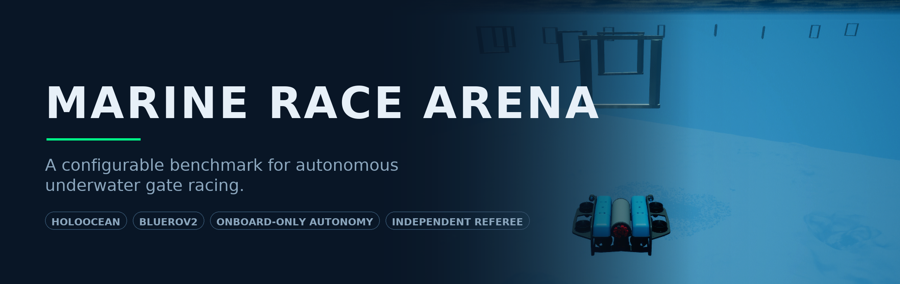
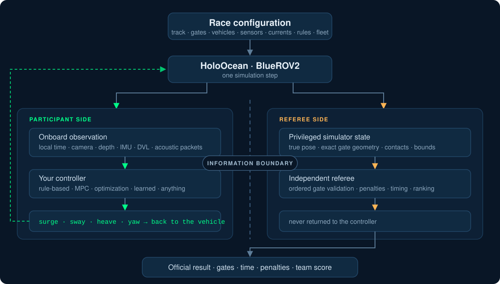
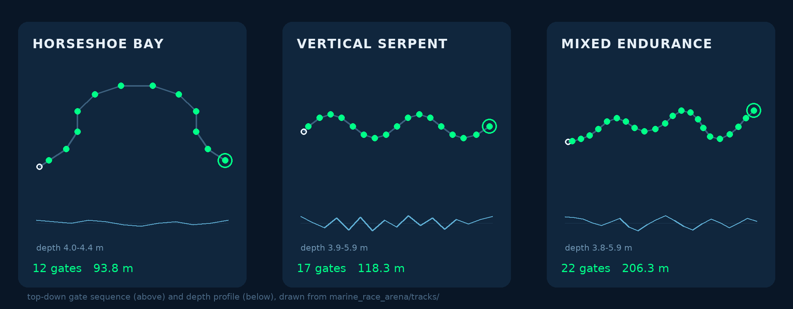

<div align="center">



<h3>Configure a race. Plug in your autonomy.<br>Let an independent referee score it.</h3>

<p>


<a href="article_journal/main.pdf"></a>
<a href="LICENSE"></a>
</p>

<a href="#quick-start"><b>Quick start</b></a> ·
<a href="#how-it-works"><b>How it works</b></a> ·
<a href="#official-circuits"><b>Circuits</b></a> ·
<a href="docs/experiments.md"><b>Ready-to-run experiments</b></a> ·
<a href="#documentation"><b>Docs</b></a>

</div>

---

## What is Marine Race Arena?

Marine Race Arena turns underwater gate racing into a **benchmark you can configure
rather than a scenario you have to accept**. A single declarative JSON file specifies
the whole race: world bounds, the ordered gate sequence with centres, passage
directions and aperture sizes, the acoustic beacon network and its noise model,
environmental current profiles, obstacle generation, and the participants — their
vehicles, onboard sensors, controllers and release delays.

The part that makes it a *benchmark* is the strict separation between autonomy and
evaluation. Your controller sees only what the vehicle could physically know: its own
elapsed time, its onboard sensors, the acoustic packets it actually received, and
optional messages from teammates. A separate referee reads privileged simulator state
— true pose, exact gate geometry, contacts, bounds — and uses it only to validate
ordered gate crossings, apply the rules and produce the official result. **Referee
state never reaches vehicle autonomy.** The reference controllers are evaluated under
the same participant-level information boundary and independent referee.

The same interface runs one vehicle or a cooperative team, so course-following,
robustness to currents and multi-vehicle coordination can all be evaluated within
the same race-management and referee framework.

## Why Marine Race Arena

| Capability | What it gives you |
|---|---|
| **Configurable races** | Tracks, gates, sensors, currents, rules and penalties are data, not code. |
| **Controller-agnostic** | Rule-based, MPC, optimization-based or learned — anything that respects the observation boundary and returns a body-frame command. |
| **Independent referee** | Scoring comes from privileged state the controller can never see, so results are comparable across methods. |
| **Seeded and auditable** | Beacons, packet loss and obstacle generation are seeded from the run seed, and every run writes an event log and a machine-readable summary. The experiment specification reproduces exactly; simulated times can drift between machines, outcomes and rankings do not. |
| **Environmental disturbance** | Current profiles turn a solved clean circuit back into an open problem. |
| **Teams, not just vehicles** | Staggered starts, per-vehicle referee state, team aggregation, and distributed coordination over the acoustic channel. |

## How it works

<div align="center">

</div>

## Official circuits

Three circuits with deliberately different geometry — planar, serpentine and long —
so a controller that works on one is not assumed to work on all three.

<div align="center">

</div>

Every circuit ships with `none`, `medium` and `strong` current profiles and supports
fixed or seeded-random obstacles. Gate apertures are `1.5 × 1.5 m` throughout.

## Reference controllers

The repository ships reference implementations so there is always something to race
against — **none of them is required**.

| Controller | Idea |
|---|---|
| **Continuous Servo** | Keeps correcting visual centring all the way through the aperture. |
| **Center-then-Commit** | Establishes a stable visual lock first, then holds a committed trajectory through the gate. |
| **Leader–Follower** | Wraps either of the above and yields to a predecessor using only locally estimated progress sent over the acoustic channel. |
| **Recurrent PPO** | A frozen learned policy over the 27-D onboard encoding, included as an example of integrating learning through the same interface. |

Your controller implements three methods and returns four numbers. See
**[docs/controllers.md](docs/controllers.md)** for the full contract and a working
minimal example.

## Quick start

```bash
git clone https://github.com/AndreaBedei1/HoloDroneCompetition.git
cd HoloDroneCompetition
conda create -n ocean python=3.9 -y && conda activate ocean
```

HoloOcean 2.3.0 is not on PyPI, so install its client from source first, then this
repository's pinned dependencies and the simulator world — the three commands are in
**[docs/getting-started.md](docs/getting-started.md)**. Once that is done, race:

```bash
python -m marine_race_arena.scripts.run_marine_race \
  --track marine_race_arena/tracks/marine_race_horseshoe_bay.json \
  --benchmark-task clean_gate --controller rule_gate_center_then_commit \
  --adapter holoocean --official --headless \
  --seed 0 --dt 0.033 --duration 560 \
  --log-dir results/quickstart
```

Center-then-Commit flies the 12 gates of Horseshoe Bay and the referee prints the
official result. The run writes an event log and a summary into `results/quickstart/`.

> No HoloOcean yet? Append `--adapter fallback --allow-fallback --duration 20` to
> exercise the runner, referee and logging without the engine. It is plumbing, not
> evidence.

## Documentation

| Guide | What it covers |
|---|---|
| [Getting started](docs/getting-started.md) | Prerequisites, HoloOcean installation, environments, your first race. |
| [Controllers](docs/controllers.md) | The observation boundary, the action interface, the controller lifecycle, and how to write and run your own. |
| [Configuration](docs/configuration.md) | Building a race from scratch: world, gates, sensors, beacons, currents, rules, penalties, fleets. |
| [Experiments](docs/experiments.md) | Copy-paste commands for clean circuits, currents, fleets, coordination and the learned controller. |
| [Reproducing the paper](docs/reproducing-the-paper.md) | Verifying every reported number, regenerating the tables and figures, building the manuscript. |

## Paper

Marine Race Arena is described in a manuscript prepared for submission to *Robotics
and Autonomous Systems*. The compiled preprint travels with the repository:
**[article_journal/main.pdf](article_journal/main.pdf)**.

Every quantity in it is recomputed from the evidence package in
[`artifacts/paper/`](artifacts/paper/) by a single command:

```bash
python article_journal/scripts/verify_claims.py
```

## Citation

If Marine Race Arena is useful in your work, please cite the manuscript:

```bibtex
@unpublished{bedei2026marineracearena,
  author = {Bedei, Andrea and Bacchiani, Lorenzo and Pau, Giovanni and Girau, Roberto},
  title  = {Marine Race Arena: A Configurable HoloOcean Benchmark for Underwater
            Gate Racing and Team-Level Fleet Evaluation},
  note   = {Manuscript prepared for submission to Robotics and Autonomous Systems},
  year   = {2026},
  url    = {https://github.com/AndreaBedei1/HoloDroneCompetition}
}
```

Machine-readable metadata is in [CITATION.cff](CITATION.cff).

## License

Released under the [MIT License](LICENSE) — use it, modify it, build on it. If
it helps your work, a citation is appreciated.

## Acknowledgements

Marine Race Arena is built on [HoloOcean](https://github.com/byu-holoocean/HoloOcean)
(BYU FRoStLab) and its Ocean world, and races a BlueROV2-class vehicle.
